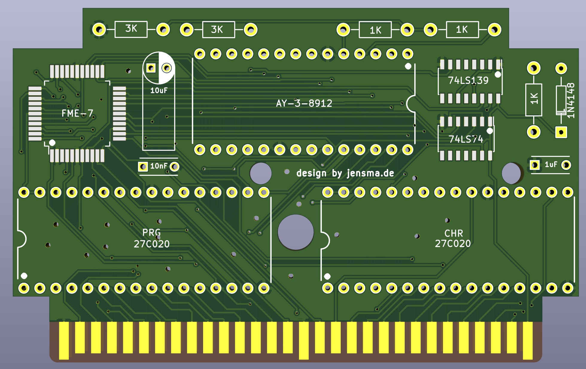
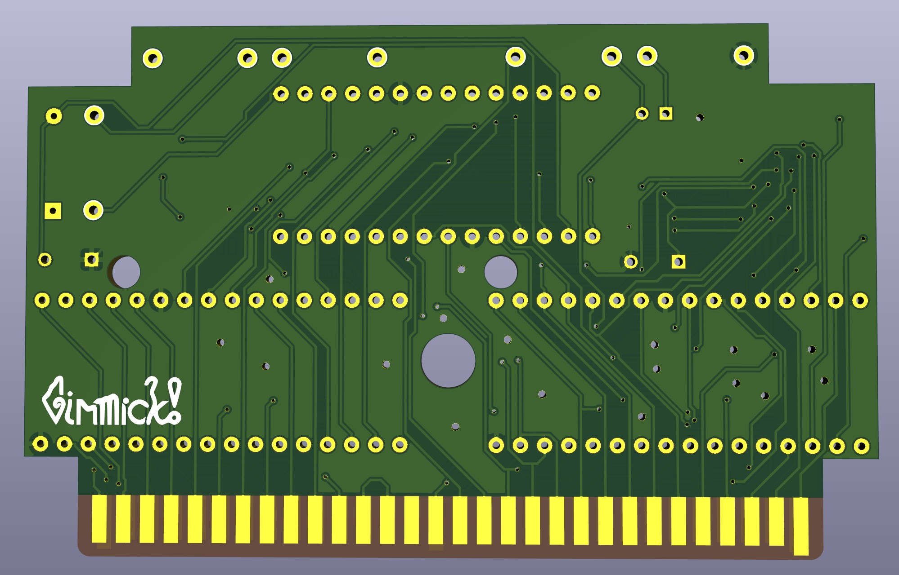

# Gimmick Repro PCB for Famicom

This project provides all necessary files to create a custom reproduction PCB for the Famicom game "Gimmick!".

**the PCB thickness must be 1.2mm** to ensure compatibility with Famicom cartridges and hardware. Having it chamfered is even better for your cartridge slot, but not necessary.

### Features
- **Logo Option**: The Gerber files include two versions:
  - **With Gimmick! Logo** on the back side of the PCB.
  - **Without Logo** for a clean design.

